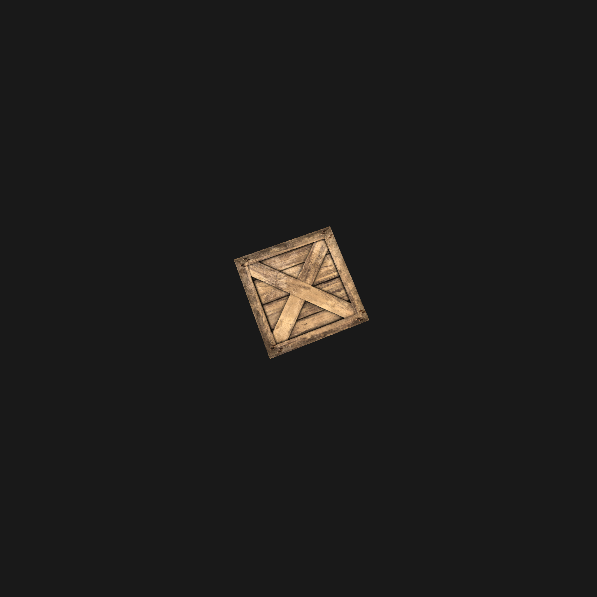

# Scope

### Goals

* Reflection
* Real-time
* Textures

### Limitations

* Only one reflecting object
* No light or shadow
* No interactivity

### Narcisse

* Modern C++
* Small engine
* JSON formatted scenes (using `nlohmann json`)
* OBJ models (`tinyobjloader`)
* Deserialization using `boost::hana`
* Matrix and vectors with `glm`
* Check it out at [`gitlab.com/robin.le_bihan/narcisse`](https://www.gitlab.com/robin.le_bihan/narcisse)

# Implementation

### Abstractions

* Extensive use of move semantics
* Ownership management (cc Rustaceans)
* Encapsulation of `GLuint`

#### Templated shaders
```c++
auto shader = make_shader<vertex_shader_t>("vertex.glsl");
if (!shader)
    std::cerr << shader.error() << '\n';
```

#### Program
```c++
auto program = make_program("vertex.glsl", "fragment.glsl");
```

### Abstractions

#### VBO
```c++
glm::vec3 vertices[] =
{
    glm::vec3(1, 0, 0),
    glm::vec3(-1, 0, 0),
    glm::vec3(0, 1, 0)
};

auto vbo = VBO<float, 3>(begin(vertices), end(vertices));
```

#### Bind to shader
```c++
program->attrib("vertices") = vbo;
```

### Cube map

* 6-sided texture
* Cube template
* Mainly used for skybox

"){ width=200px }

### Render to frame buffer

* Render from center of camera
* Dump to frame buffer
* Fill cube map with the 6 sides
* Apply cube map to sphere with reflection shader

{ width=100px }
{ width=100px }
{ width=100px }
{ width=100px }

### Shader

```c
#version 450

layout(location = 0) out vec4 outColor;
in vec3 fPosition;
in vec3 fNormal;
uniform vec3 cameraPos;
uniform samplerCube reflectionMap;

void main() {
    vec3 incident = normalize(fPosition - cameraPos);
    vec3 reflected = reflect(incident, fNormal);
    outColor = vec4(
        texture(reflectionMap, normalize(reflected)).rgb, 1.0
    );
}
```

# Demo

### Demo

Time to show off !

{ width=200px }

# Conclusion

### Conclusion

:::::::::::::: {.columns}
::: {.column width="50%"}
>- Fun project...
>- ...but hard
>- ...and time consuming
>- Practical session dedicated to abstractions
:::
::: {.column width="50%"}
>- { height=270px }
:::
::::::::::::::
